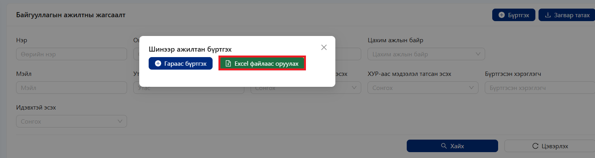
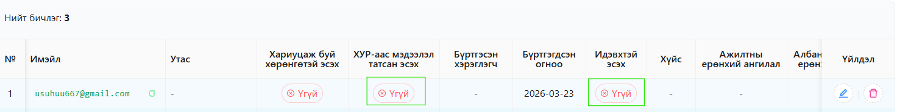
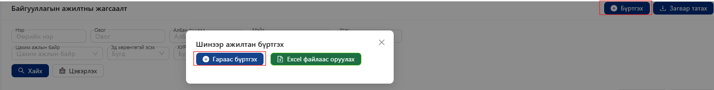
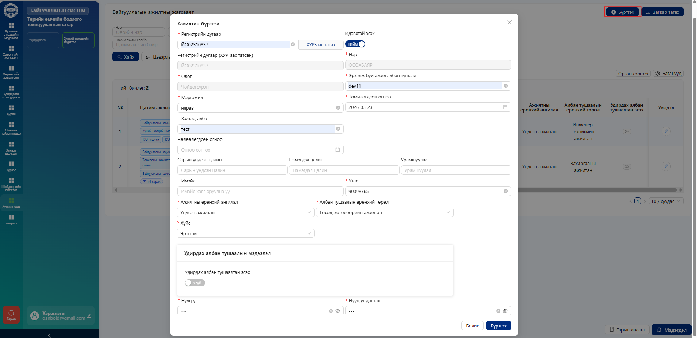
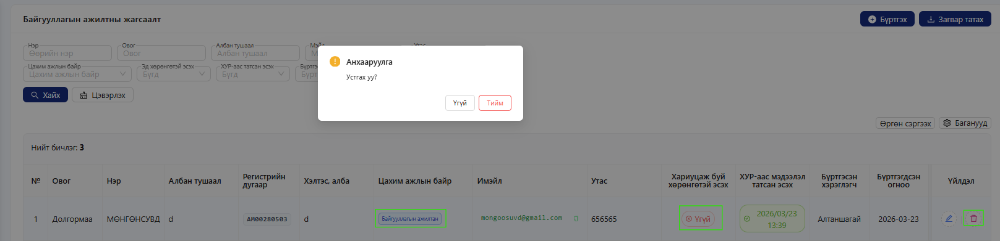

# Ажилтан

#### Ажилтны мэдээллийг дараах хоёр аргаар бүртгэх боломжтой:

**Системээр шууд бүртгэх**

* **“Бүртгэх”** товчийг дарж ажилтны мэдээллийг гараар оруулна.

&#x20;**Excel файлаар импортлох**

* **“Загвар татах”** товчийг дарж Excel загвар файлыг татаж авна
* Загварын дагуу ажилтны мэдээллийг бөглөнө.

<figure><figcaption></figcaption></figure>

**“Excel файлаас оруулах”** товчийг дарж файлаа системд оруулна.

<figure><figcaption></figcaption></figure>

<figure><figcaption></figcaption></figure>

Ажилтны мэдээллийг системд оруулсны дараа дараах алхмуудыг гүйцэтгэнэ:

1. Жагсаалтаас тухайн ажилтны .png>) **засварлах** товчийг дарна
2. Ажилтны **регистрийн дугаарыг** гараар оруулна.
3. **“ХУР-аас татах”** товчийг дарж мэдээллийг татна.
4. Ажилтны мэдээллийг шалгаж  **идэвхтэй болгоно.**

📌 **Анхаарах зүйл:**

* **“ХУР-аас татах”** үйлдлийг гүйцэтгэснээр ажилтны мэдээлэл автоматаар шинэчлэгдэнэ.
* Ажилтан идэвхэжсэний дараа цахим ажлын байр баганад **“Байгууллагын ажилтан”** эрх үүснэ.

<figure><figcaption></figcaption></figure>

"<mark style="color:$primary;">**Гараас бүртгэх**</mark>" товч дарж ажилтнуудыг нэг нэгээр нь бүртгэх боломжтой.

<figure><figcaption></figcaption></figure>

Ажилтан бүртгэхдээ талбаруудыг үнэн зөв бөглөн бүртгэх товч дээр дарна.

<figure><figcaption></figcaption></figure>

Байгууллагын ажилтнуудыг системд амжилттай бүртгэсний дараа **“Байгууллагын ажилтны жагсаалт”** хэсэгт хүснэгт хэлбэрээр харагдана.&#x20;

<figure><figcaption></figcaption></figure>

Цахим ажлын байрнаас хасагдсан хэрэглэгч нь хүний нөөцийн бүртгэлд зөвхөн **"Байгууллагын ажилтан"** цахим ажлын байр эрхтэй үлдэнэ.

Хэрэв тухайн хэрэглэгч нь байгууллагын **ямар нэгэн хөрөнгө хариуцдаггүй** бол бүртгэлээс устгах боломжтой.

**Устгах нөхцөл**

* Хэрэглэгчид хариуцах хөрөнгө байхгүй байх
* Мэдээлэл хадгалах шаардлагагүй болсон байх

📌 **Анхаарах зүйл:**

* Хөрөнгө хариуцаж байгаа хэрэглэгчийг устгах боломжгүй
* Устгахын өмнө холбогдох мэдээллийг шалгах шаардлагатай
* Устгасан мэдээллийг сэргээх боломжгүй байж болно.

🔐 Эрхийн шаардлага

* Зөвхөн **хүний нөөцийн мэргэжилтэн эрхтэй** хэрэглэгч энэ үйлдлийг гүйцэтгэнэ
* Энгийн хэрэглэгч өөрийн болон бусдын мэдээллийг устгах боломжгүй

<figure><figcaption></figcaption></figure>

&#x20;
