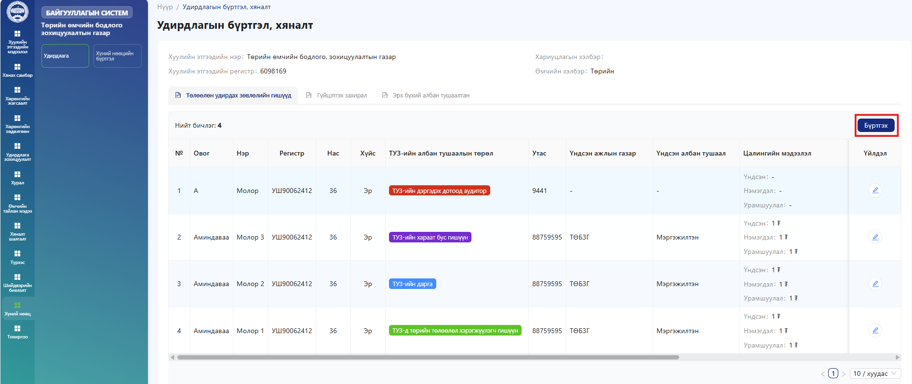
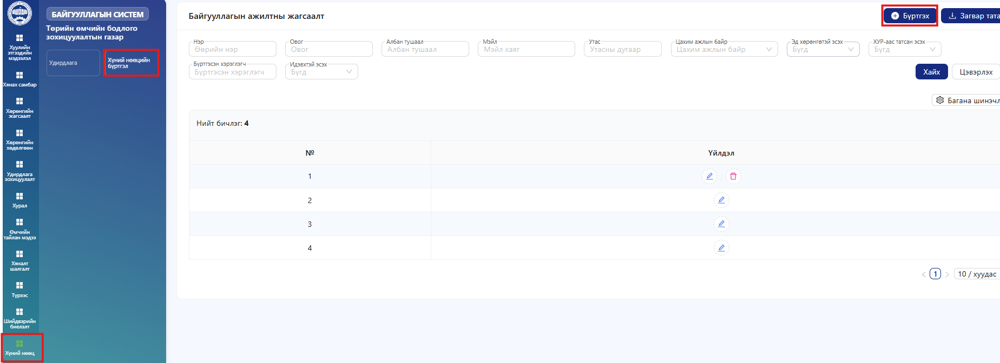
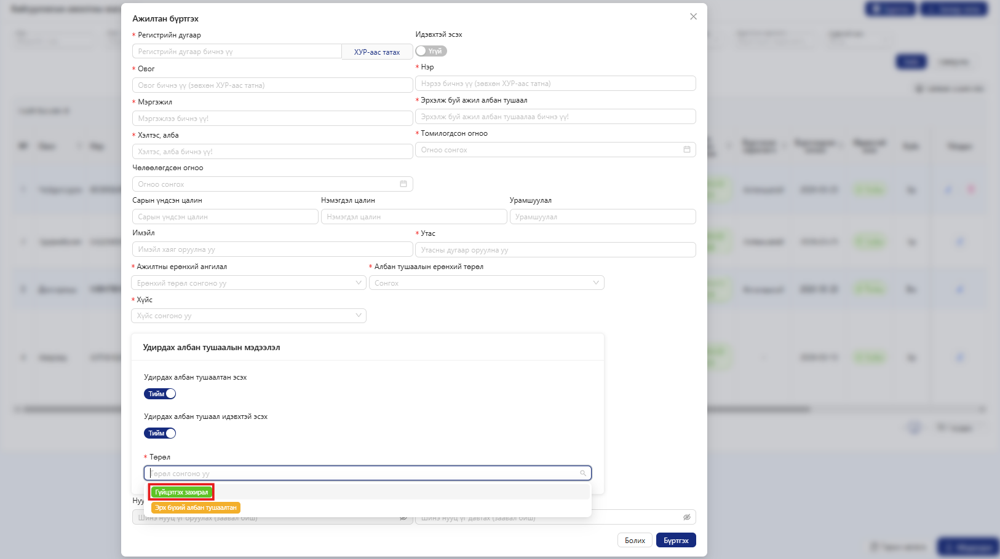
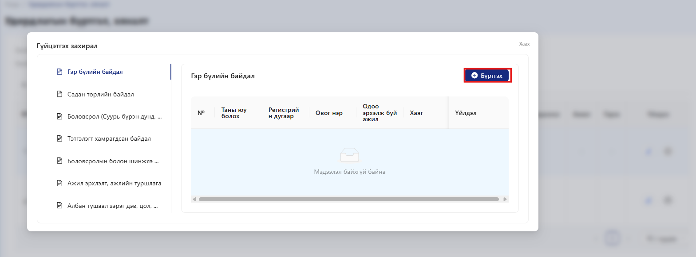

# Удирдлага

Төлөөлөн удирдах зөвлөлийн (ТУЗ) гишүүдийг бүртгэхийн тулд .png>) товчийг дарж мэдээллийг шинээр оруулна.

<figure><figcaption></figcaption></figure>

Шаардлагатай бүх талбарт мэдээллийг үнэн зөв, бүрэн гүйцэд оруулсны дараа оруулсан мэдээллээ дахин нягталж, алдаа байхгүй эсэхийг шалгана. Баталгаажуулсны үндсэн дээр .png>) товч дарна.

<figure><figcaption></figcaption></figure>

ТУЗ-ийн албан тушаалтнуудыг амжилттай бүртгэсний дараа бүртгэсэн мэдээлэл дараах байдлаар харагдана.

<figure><figcaption></figcaption></figure>

**Гүйцэтгэх захирал** болон **Эрх бүхий албан тушаалтан** мэдээллийг бүртгэхдээ **Хүний нөөцийн бүртгэлийн** хэсэгт байрлах .png>) цэсээр дамжуулан бүртгэнэ.

<figure><figcaption></figcaption></figure>

Шаардлагатай бүх талбарыг үнэн зөв, бүрэн бөглөж, **“Удирдах албан тушаалтан эсэх”**-ийг **“Тийм”** төлөвт тохируулна. Дараа нь **“Төрөл”** цэсээс  болон .png>) сонгон **“Бүртгэх”** товчийг дарснаар тухайн мэдээлэл **Удирдлагын бүртгэл,хяналт** цэст амжилттай бүртгэгдэнэ.

<figure><figcaption></figcaption></figure>

Энэ хэсэгт **Гүйцэтгэх захирал** болон **Эрх бүхий албан тушаалтаны** бүртгэл, холбогдох мэдээллийг харах, хянах боломжтой. Та тухайн мэдээллийг засварлах, шинэчлэх үйлдлийг **“Үйлдэл”** хэсгээс гүйцэтгэнэ.

<figure><figcaption></figcaption></figure>

**Гүйцэтгэх захирал** болон **Эрх бүхий албан тушаалтаны** анкет бөглөхдөө **Үйлдэл** хэсгийн .png>) товчийг дарж дэд цэсүүд рүү орно. Тухайн цэс бүр дээр **“Бүртгэх”** товчийг дарж шаардлагатай мэдээллийг талбар бүрт бөглөн хадгална. Бүртгэсэн мэдээлэл нь тухайн хэсгийн хүснэгтэд шууд харагдана.

<figure><figcaption></figcaption></figure>
