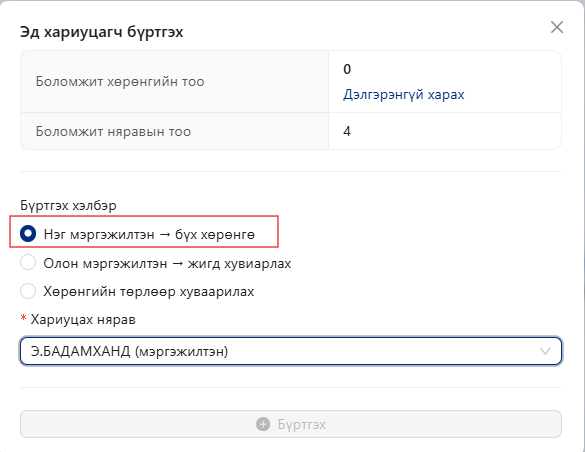
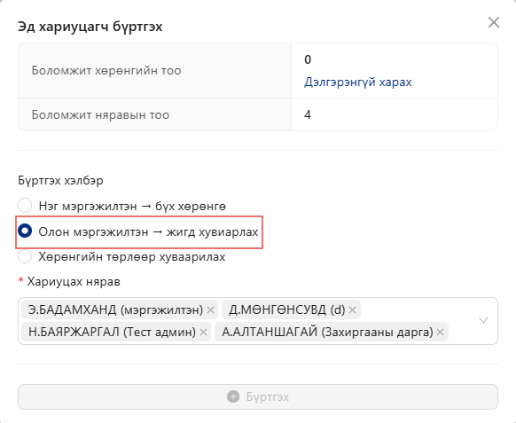
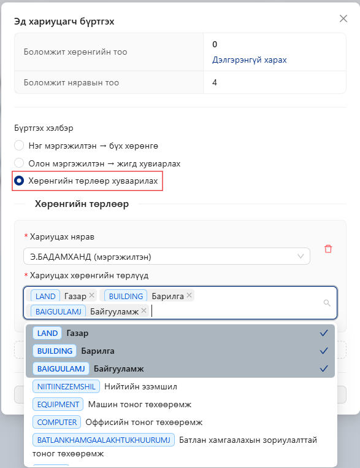
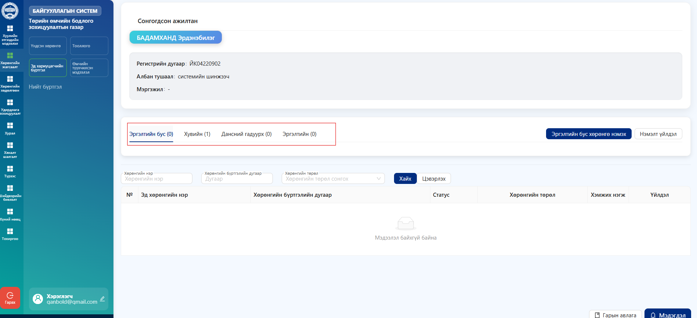

# Эд хариуцагчийн бүртгэл

Энэ хэсэгт байгууллагын эд хөрөнгийг хариуцан ашиглаж буй ажилтны мэдээллийг бүртгэнэ. Эд хариуцагчийг нэмэх, засах, устгах болон холбогдох эрхийг тохируулах боломжтой.

<figure><figcaption></figcaption></figure>

**Эд хариуцагч жагсаалт үүсгэх** товчийг дарж, **Эд хариуцагч бүртгэх** хэсэгт орно.

**Бүртгэх хэлбэр** хэсгээс **Нэг мэргэжилтэн → бүх хөрөнгө** сонгоно.

* Энэ сонголт нь бүх хөрөнгийг нэг ажилтанд хариуцуулдаг.
* Байгууллагад ажилтан цөөн тоотой бол бүх хөрөнгийг нэг няравт хариуцуулж өгөх боломжтой.

<figure><figcaption></figcaption></figure>

*   **Олон мэргэжилтэн → жигд хуваарилах**

    Хэрэв байгууллага олон салбартай бөгөөд ажилтан олон тоотой бол, байгууллагын хөрөнгийг олон няравт жигд хуваарилж өгөх боломжтой. Ингэснээр нэг ажилтанд хэт ачаалал ирэхгүй, хөрөнгийн хариуцлага тэнцвэртэй хуваарилагдан, удирдлага, бүртгэл илүү хялбар болно.

    Энд:

    * **“Олон салбартай”** → байгууллага нь нэг төв оффисоос гадна салбар нэгжүүдтэй.
    * **“Ажилтан олон”** → хөрөнгийг нэг хүнд хариуцуулж хэт ачаалал үүсэхээс зайлсхийх.
    * **“Жигд хуваарилах”** → хөрөнгийг тэнцүү хуваарилж, хариуцлага тэнцвэртэй байх.

<figure><figcaption></figcaption></figure>

* **Хөрөнгийн төрлөөр хуваарилах**
  * Энэ сонголт нь **хөрөнгийг төрөл тус бүрээр өөр ажилтанд хариуцуулдаг**.
  * Жишээ нь: газар, барилга, байгууламж зэрэг хөрөнгийн төрөл бүрд өөр хариуцагч томилох боломжтой.

&#x20;  **Хариуцагч сонгох:**

* **“Хариуцах нярав”** хэсгээс тухайн ажилтны нэрийг сонгоно.
* Ингэснээр тухайн нярав зөвхөн сонгосон хөрөнгийн төрөлд хариуцлага хүлээнэ.

&#x20;  **Хөрөнгийн төрлийг сонгох:**

* **“Хариуцах хөрөнгийн төрлүүд”** талбараас тухайн ажилтанд хариуцуулмаар хөрөнгийн төрлийг сонгоно.
* Олон төрлийг нэгэн зэрэг сонгож өгөх боломжтой.

<figure><figcaption></figcaption></figure>

Үйлдэл цэсийн  .png>) товчийг даран орохоор **хөрөнгийн ангилал  харагдана**

**Эргэлтийн бус** \
Байгууллагад урт хугацаанд ашиглагддаг, үнэ цэнэ нь нэг дор биш хугацааны явцад элэгддэг үндсэн хөрөнгө.\
&#xNAN;_&#x416;ишээ:_ компьютер, ширээ, сандал, машин, тоног төхөөрөмж&#x20;

**Хувийн** \
Ажилтанд хувийн хэрэглээнд олгосон, тухайн ажилтан өөрөө хариуцаж ашиглах хөрөнгө.\
&#xNAN;_&#x416;ишээ:_ зөөврийн компьютер, гар утас, ажлын хэрэгсэл.&#x20;

**Дансны гадуурх** \
Байгууллагын үндсэн дансанд бүртгэгддэггүй боловч ашиглалтад байгаа хөрөнгө.\
&#xNAN;_&#x416;ишээ:_ түр ашиглаж байгаа төхөөрөмж, туршилтын тоног төхөөрөмж.

**Эргэлтийн** \
Богино хугацаанд ашиглагдаж дуусдаг, хэрэглээний материалууд.\
&#xNAN;_&#x416;ишээ:_ бичгийн хэрэгсэл, цаас, хор, жижиг сэлбэг.

<figure><figcaption></figcaption></figure>

Эргэлтийн бус хөрөнгө нь байгууллагын үйл ажиллагааны тогтвортой байдлыг хангахад чухал үүрэгтэй. Эдгээр хөрөнгийг урт хугацаанд ашигладаг тул элэгдэл тооцож бүртгэдэг. Иймээс байгууллагууд ихэнхдээ хөрөнгөө эргэлтийн бус хөрөнгөнд бүртгэдэг.

<figure><figcaption></figcaption></figure>

Жагсаалтын дэлгэц дээр байрлах **“Нэмэлт үйлдэл”** товчийг ашиглан тухайн хөрөнгөнд нэмэлт үйлдлүүд хийх боломжтой. Үүнд хөрөнгийг өөр зориулалт, ангилалд шилжүүлэх зэрэг үйлдлүүд багтана.

<figure><figcaption></figcaption></figure>

**“Нэмэлт үйлдэл”** товчийг дарсны дараа дараах сонголтууд бүхий цонх нээгдэнэ:

* **Шилжүүлэх** – Хөрөнгийг өөр ангилал, зориулалт руу шилжүүлэх
* **Батлах** – Хийгдсэн өөрчлөлтийг баталгаажуулах
* **Түүх** – Хөрөнгийн өмнөх өөрчлөлтийн түүх харах

👉 Эдгээрээс **“Шилжүүлэх”** товчийг сонгоно.

<figure><figcaption></figcaption></figure>

**Хөрөнгө шилжүүлэх заавар**

Хөрөнгийг нэг нярваас нөгөө няравт шилжүүлэхдээ дараах алхмуудыг дагана.

**Алхам 1: Хүлээн авагч нярав сонгох**

1. “Эд хөрөнгө шилжүүлэх” цонхонд орно.
2. **“Хүлээн авагч”** хэсгээс шилжүүлгийг хүлээн авах нярвыг сонгоно.
   * Жишээ: _А.Алтаншагай_
3. Сонгосон нярав нь шилжүүлгийн дараа тухайн хөрөнгийг хариуцах болно.

**Алхам 2: Шилжүүлэх хөрөнгө сонгох**

1. Доорх жагсаалтаас шилжүүлэх хөрөнгүүдийг сонгоно.
2. Хөрөнгө бүрийн урд байрлах **checkbox**-ийг идэвхжүүлж сонголт хийнэ.
3. Сонгосон хөрөнгийн тоо дээд хэсэгт автоматаар харагдана.
   * Жишээ: _“Сонгосон эд хөрөнгийн тоо: 2 ширхэг”_

**Алхам 3: Хайлт болон шүүлт ашиглах (шаардлагатай бол)**

Хэрэв олон хөрөнгө дундаас хайх шаардлагатай бол:

* **Хөрөнгийн нэр**-ээр хайх
* **Бүртгэлийн дугаар** оруулах
* **Хөрөнгийн төрөл** сонгох  Дараа нь **“Хайх”** товчийг дарж жагсаалтыг шүүнэ.\
  Хайлт цэвэрлэх бол **“Цэвэрлэх”** товчийг ашиглана.

**Алхам 4: Шилжүүлэх үйлдэл хийх**

1. Шилжүүлэх хөрөнгүүдээ сонгосны дараа баруун доод буланд байрлах **“Шилжүүлэх”** товчийг дарна.
2. Систем шилжүүлгийн үйлдлийг бүртгэж, сонгосон няравт хөрөнгийг шилжүүлнэ.

**Анхаарах зүйлс**

* Хүлээн авагч нярвыг заавал зөв сонгосон эсэхийг шалгана.
* Хөрөнгө сонгоогүй тохиолдолд шилжүүлэх боломжгүй.
* **“Бүгдийг цуцлах”** товчийг дарснаар бүх сонголтыг цуцлах боломжтой.
* Шилжүүлгийн дараа тухайн хөрөнгө шинэ нярвын хариуцлагад бүртгэгдэнэ.

<figure><figcaption></figcaption></figure>
