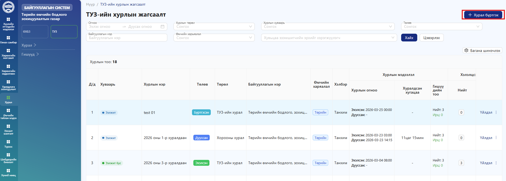
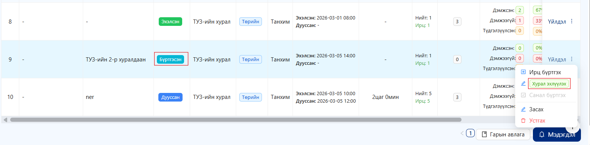
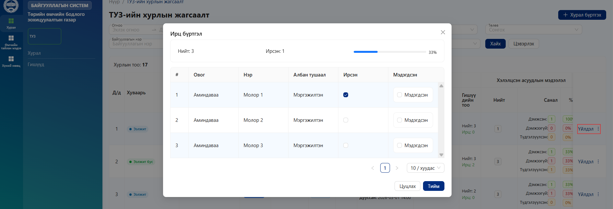
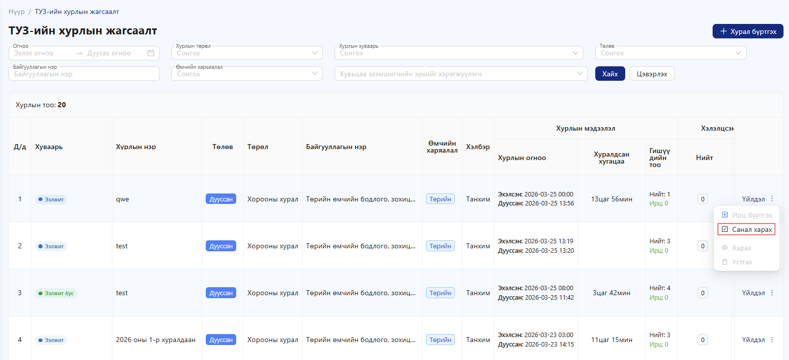
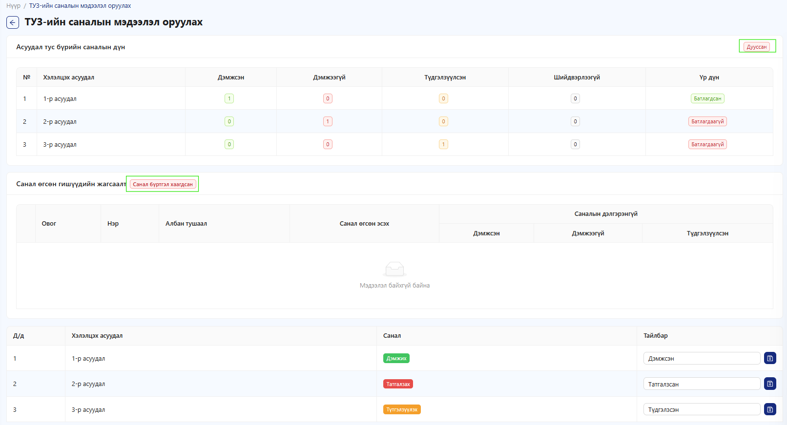

# ТУЗ

* **Хурал** – Төлөөлөн удирдах зөвлөлийн (ТУЗ) хурлуудтай холбоотой бүх мэдээллийг төвлөрүүлэн **бүртгэх, харах, засварлах, удирдах** үндсэн модуль
* **Гишүүд** – Тухайн хуулийн этгээдийн ТУЗ-ийн гишүүдийн мэдээллийг жагсаалтын хэлбэрээр харуулна. Энэ хэсэгт гишүүний нэр, албан тушаал болон холбогдох бусад мэдээллийг харах боломжтой.

ТУЗ-н нарийн бичгийн эрхтэй системийн хэрэглэгч **Хурал бүртгэх** товч дарж хурлын бүртгэлийг хийнэ.

<figure><figcaption></figcaption></figure>

.png>) цонх нээгдэхэд **Бүртгэгдсэн ТУЗ-н гишүүдийн** мэдээллийг автоматаар авч хуралд оролцох гишүүдийн мэдээллийг харуулна. Мэдээллүүдийг бөглөж хадгалах товч дарна мөн .png>)талбарыг заавал бөглөх шаардлагатай.

<figure><figcaption></figcaption></figure>

Хурлын жагсаалт нь тухайн хуулийн этгээдийн ТУЗ-н хийгдсэн хурлуудын мэдээллийг жагсаалтаар харуулна. Хурлын төлөвөөр нь тухайн хурал **бүртгэгдсэн**, **эхэлсэн**, **дууссан** мэдээллийг харах боломжтой.

<figure><figcaption></figcaption></figure>

Хурал бүртгэсний дараа .png>)цэсээс .png>) товч дарна.

<figure><figcaption></figcaption></figure>

Хурал эхэлсэн төлөвт орсны дараа үйлдэл цэсээс **Ирц бүртгэх** товч даран тухайн хурлын ирцийн мэдээллүүдийг бүртгэнэ.

<figure><figcaption></figcaption></figure>

Хурлын ирц бүртгэсний дараа .png>) цэс дээр даран .png>)цэс рүү орон хэлэлцэх асуудлын саналаа оруулна.

<figure><figcaption></figcaption></figure>

**Санал оруулах алхам**

* ТУЗ гишүүний мөрний зүүн талд байрлах **дэлгэх (+) товч** дээр дарна
* Хэлэлцэх асуудлын жагсаалт гарч ирнэ.
* **“Санал дэмжих эсэх”** хэсгийн сонголтыг дарна.

Доорх сонголтуудаас нэгийг сонгоно;

* **Дэмжсэн** – тухайн асуудлыг зөвшөөрч санал өгсөн
* **Дэмжээгүй** – тухайн асуудлыг зөвшөөрөхгүй
* **Түдгэлзүүлсэн** – санал өгөхөөс түдгэлзсэн
* Хэрэв шаардлагатай бол **“Тайлбар”** хэсэгт нэмэлт тайлбар бичиж болно.

<figure><figcaption></figcaption></figure>

Гишүүд санал өгсний дараа асуудал тус бүрийн саналын дүн харагдана.

<figure><figcaption></figcaption></figure>

Гишүүдийн саналыг бүртгэсний дараа хурлын жагсаалтаас тухайн хурлыг хэлэлцүүлж дууссан гэж үзэх тохиолдолд төлөв нь .png>)хурлыг сонгон .png>) цэсээс .png>)товч даран хурлын мэдээллийг бүртгэжүүлэх үйл ажиллагаа дуусна.

<figure><figcaption></figcaption></figure>

Жагсаалтаас хурлын төлөв  төлөвт шилжсэн байгаа нь харагдах болно. Хурал дууссаны дараа **Үйлдэл** цэсэд зөвхөн дараах сонголт идэвхтэй байна: .png>)энэ нь тухайн хурлын саналын дүнтэй танилцах боломжийг олгоно.

<figure><figcaption></figcaption></figure>

Хурлын төлөв **“Дууссан”** болсон үед санал харах хэсэг мөн **дууссан төлөвтэй** харагдана.

Хурал дууссаны дараа:

* Өмнө өгсөн саналуудыг зөвхөн харах боломжтой.
* Саналд өөрчлөлт оруулах боломжгүй.

<figure><figcaption></figcaption></figure>
