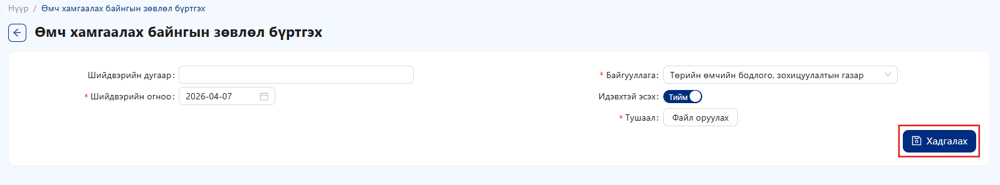
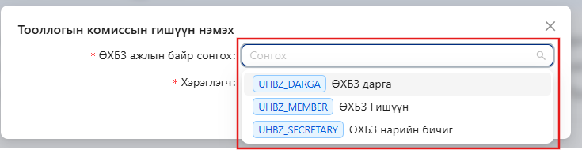
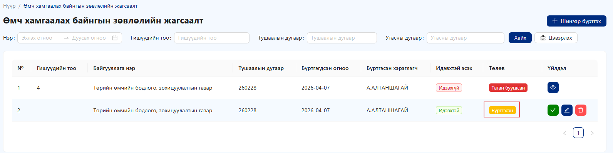
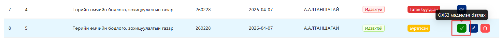
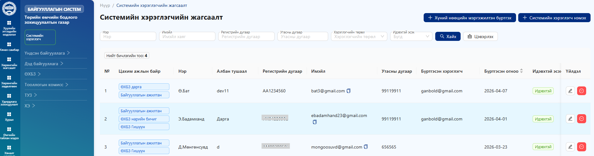
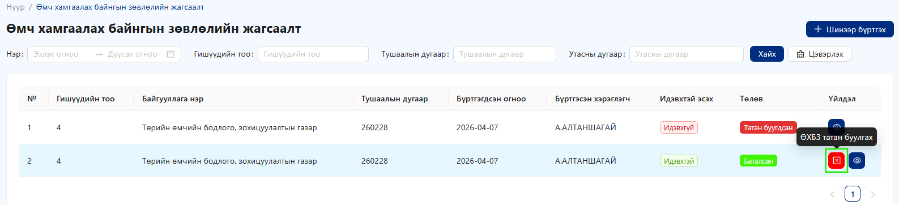

# ӨХБЗ

#### Өмч хамгаалах байнгын зөвлөл (ӨХБЗ) бүртгэл үүсгэх

Тохиргоо цэсийн ӨХБЗ-ийг сонгон орно.

Шинэ бүртгэл үүсгэхийн тулд дээрх "Шинээр бүртгэх" товчийг дарна

<figure><figcaption></figcaption></figure>

* Шинэ цонх нээгдэнэ.
* Дараах шаардлагатай мэдээллүүдийг үнэн зөв бөглөнө:
  * Шийдвэрийн дугаар
  * Шийдвэрийн огноо
  * Байгууллага
  * Идэвхтэй эсэх тохиргоо
  * Тушаал -**“Файл оруулах”** товчийг дарж холбогдох тушаал, шийдвэрийн файлыг хавсаргана.
  * Бүх мэдээллийг шалгасны дараа **“Хадгалах”** товчийг дарна.

👉 **Анхаарах зүйлс:**

* Одтой (\*) талбаруудыг заавал бөглөх шаардлагатай.

<figure><figcaption></figcaption></figure>

Бүртгэл үүсгэсний дараа **ӨХБЗ-ийн гишүүдийн мэдээллийг заавал** оруулах шаардлагатай. Гишүүдийн мэдээллийг системд дараах хоёр аргаар бүртгэх боломжтой.

**1. Байгууллагын хэрэглэгчийн жагсаалтаас нэмэх**\
Хэрэв гишүүн нь тухайн байгууллагын системд бүртгэлтэй хэрэглэгч бол “Хэрэглэгчийн жагсаалтаас нэмэх” товчийг ашиглан сонгож нэмнэ.

**2. Шинээр хэрэглэгч бүртгэж нэмэх**\
Хэрэв гишүүн нь системд бүртгэлгүй бол “Шинэ хэрэглэгч нэмэх” товчийг дарж, шаардлагатай мэдээллийг бөглөж шинээр бүртгэнэ.

Дээрх хоёр аргын аль нэгийг ашиглан бүх гишүүдийн мэдээллийг бүрэн оруулсны дараа дараагийн үйлдлийг үргэлжлүүлнэ.

<figure><figcaption></figcaption></figure>

**1. Хэрэглэгчийн жагсаалтаас нэмэх**

.png>) товчийг дарснаар байгууллагын хүний нөөцийн системд бүртгэлтэй хэрэглэгчдээс сонгож нэмэх боломжтой.

* **“ӨХБЗ ажлын байр”** хэсгээс тухайн гишүүний албан үүргийг сонгоно.
* **“Хэрэглэгч”** хэсгээс жагсаалтаас тухайн хүнийг сонгоно.
* Мэдээллийг сонгосны дараа **“Хадгалах”** товчийг дарж нэмнэ

<figure><figcaption></figcaption></figure>

Тооллогын комиссын ажлын байр нь тухайн гишүүн тооллогын комисст ямар үүрэгтэй оролцохоос хамааран системд ажиллах эрхийн хэмжээг зааж өгнө.

<figure><figcaption></figcaption></figure>

**2. Шинэ хэрэглэгч бүртгэж нэмэх**

Хэрэв нэмэх гишүүн системд бүртгэлгүй бол .png>) товчийг ашиглана.

* Товчийг дарж шинэ хэрэглэгч бүртгэх цонхыг нээнэ.
* Шаардлагатай бүх мэдээллийг бүрэн бөглөнө (ажлын байр, байгууллага, нэр, холбоо барих мэдээлэл гэх мэт).
* **“Идэвхтэй эсэх”** тохиргоог **“Тийм”** болгож идэвхжүүлнэ.
* Мэдээллийг шалгасны дараа **“Бүртгэх”** товчийг дарж хэрэглэгчийг үүсгэнэ.

Дээрх аргуудыг ашиглан ӨХБЗ-ийн бүх гишүүдийг бүртгэсний дараа дараагийн алхам руу шилжинэ.

<figure><figcaption></figcaption></figure>

ӨХБЗ-ийн гишүүдийг дээрх хоёр аргаар бүртгэсний дараа гишүүдийн мэдээлэл жагсаалт хэлбэрээр харагдана.

Бүртгэсэн мэдээллүүд зөв эсэхийг нягталсны дараа **“Хадгалах”** товчийг дарж баталгаажуулна.

<figure><figcaption></figcaption></figure>

**Хадгалалт амжилттай** хийгдсэний дараа тухайн ӨХБЗ нь системийн жагсаалтад <mark style="color:yellow;">**бүртгэгдсэн**</mark> төлөвт шилжинэ.

Ингэснээр:

* ӨХБЗ бүртгэл бүрэн хадгалагдана
* Жагсаалтад “Бүртгэсэн” төлөвтэй харагдана
* Цаашид тухайн бүртгэлийг ашиглах боломжтой болно

&#x20;   Анхаарах зүйлс:

* Гишүүдийн мэдээлэл дутуу эсвэл буруу тохиолдолд хадгалах боломжгүй байж болно.
* Хадгалахаас өмнө бүх гишүүдийн мэдээллийг бүрэн оруулсан эсэхийг шалгана.

<figure><figcaption></figcaption></figure>

Бүртгэл <mark style="color:yellow;">**“Бүртгэсэн”**</mark> төлөвт орсны дараа ӨХБЗ-ийн мэдээллийг баталгаажуулах боломжтой.

Үүний тулд **үйлдэл** цэсээс батлах .png>) товч дарна

**Батлахын өмнө шалгах:**

* ӨХБЗ-ийн гишүүдийн тоо тэгш байх
* ӨХБЗ-ийн гишүүдийн тоо ≥ 4 байх

&#x20;  **Анхаарах:**

* **“Бүртгэсэн”** төлөвт үед засварлах, устгах боломжтой
* Баталгаажуулсны дараа зарим үйлдэл хязгаарлагдаж болзошгүй тул батлахаас өмнө мэдээллийг сайтар нягтална уу

<figure><figcaption></figcaption></figure>

**Баталсан** төлөвтэй тохиолдолд гишүүний мэдээллийг харах болон ӨХБЗ татан буулгах 2 үйлдлийг хийх боломжтой.

<figure><figcaption></figcaption></figure>

Төлөв **“Батлагдсан”** болсон тохиолдолд тухайн **ӨХБЗ-ийн гишүүний мэдээлэл** нь системийн **“Хэрэглэгчийн жагсаалт”** хэсэгт автоматаар нэмэгдэж, харагдана.

<figure><figcaption></figcaption></figure>

**📘 ӨХБЗ татан буулгах дэлгэрэнгүй заавар**

🟢 Алхам 1: ӨХБЗ-ийн жагсаалт руу орно

* Үндсэн цэснээс:
  * **“ӨХБЗ”** эсвэл **“Зөвлөлийн жагсаалт”** хэсгийг сонгоно.

🟢 Алхам 2: Татан буулгах зөвлөлийг сонгох

* Жагсаалтаас татан буулгах гэж буй ӨХБЗ-ийг олно.
* Тухайн мөрийг сонгоно.

🟢 Алхам 3: Үйлдлийн товч ашиглах

* Сонгосон мөрийн баруун талд байрлах **үйлдлийн** .png>) **товч** дээр дарна.
* Гарч ирэх цэснээс:
  * **“ӨХБЗ татан буулгах”** командыг сонгоно.

🟢 Алхам 4: Үр дүн шалгах

* ӨХБЗ системд идэвхгүй байна.
* Түүнтэй холбоотой:
  * Цахим ажлын байрууд автоматаар хэрэглэгчийн жагсаалтаас хасагдана.

⚠️ Анхааруулга

* Энэ үйлдэл **буцаагдах боломжгүй**.
* Дараах зүйлсийг заавал шалгана:
  * ✔ Бүх гишүүд ажлаа бүрэн хүлээлгэн өгсөн эсэх
  * ✔ Чухал мэдээлэл хадгалагдсан эсэх
  * ✔ Холбогдох ажлууд бүрэн дууссан эсэх

<figure><figcaption></figcaption></figure>

ӨХБЗ-ийн жагсаалтаас огноо, гишүүдийн тоо, тушаалын дугаар, утасны дугаар гэсэн сонголтуудаас сонгон  товч дарж тухайн сонголтод хамааран ӨХБЗ-ийн мэдээллийг шүүж харах боломжтой.  дарж хайлт хийх хэсэгт оруулсан сонголтуудын мэдээллийг арилгана.

<figure><figcaption></figcaption></figure>
