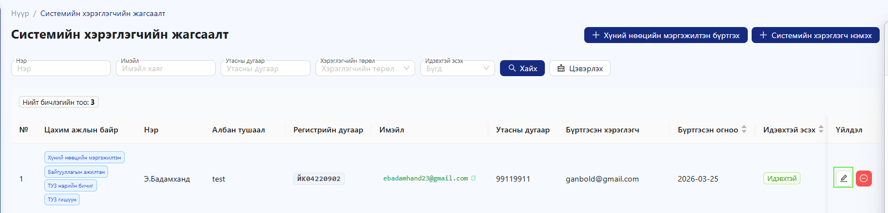
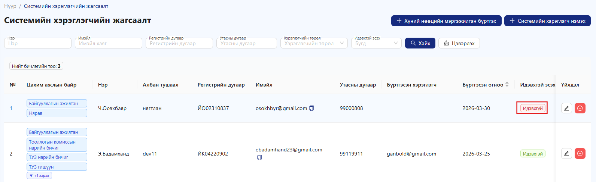

# Системийн хэрэглэгч

**Үндсэн байгууллагад цахим ажлын байр нэмэх, хүний нөөцийн мэргэжилтэн бүртгэх**

Ажилтанд нэмэлт эрх (цахим ажлын байр) олгохын тулд дараах алхмуудыг дагана уу:

1. **“Тохиргоо”** цэс рүү орно.
2. **“Үндсэн байгууллага”** хэсгийг сонгоно.
3. **“Системийн хэрэглэгч нэмэх”** товчийг дарна.

<figure><figcaption></figcaption></figure>

**“Системийн хэрэглэгч нэмэх”** товчийг дарсны дараа бүртгэлийн цонх нээгдэнэ.

Дараах байдлаар мэдээллийг бөглөнө:

1. **Ажилтан** талбараас тухайн ажилтныг сонгоно
   * Ажилтан сонгосны дараа холбогдох мэдээлэл автоматаар бөглөгдөнө
2. **Цахим ажлын байр** талбараас ажилтанд олгох эрхийг сонгоно
   * Жишээ: Байгууллагын ажилтан, Нягтлан бодогч, Захирал гэх мэт
3. Шаардлагатай бусад мэдээллийг шалгаж баталгаажуулна.

📌 **Анхаарах зүйл:**

* Ажилтан сонгосны дараа систем автоматаар регистр, овог, нэр зэрэг мэдээллийг бөглөнө
* Энэхүү үйлдлийг зөвхөн байгууллагын **Админ эрхтэй хэрэглэгч** гүйцэтгэнэ
* Нэмэлт эрх тохируулснаар ажилтны системд хандах боломж өргөжнө

<figure><figcaption></figcaption></figure>

**Хүний нөөцийн мэргэжилтэн бүртгэх**

Хүний нөөцийн мэргэжилтэн бүртгэх үйлдлийг зөвхөн байгууллагын **админ эрхтэй хэрэглэгч** гүйцэтгэнэ.

**Бүртгэх алхам**

1. **“Хүний нөөцийн мэргэжилтэн бүртгэх”** товчийг дарна
2. Нээгдсэн цонхонд **регистрийн дугаарыг** оруулна
3. **“ХУР-аас татах”** товчийг дарна
   * Овог, нэр зэрэг мэдээлэл автоматаар бөглөгдөнө
4. Үлдсэн шаардлагатай мэдээллийг гараар бөглөн **“Бүртгэх”** товчийг дарж хадгална

📌 **Анхаарах зүйл:**

* “ХУР-аас татах” үйлдлийг ашигласнаар мэдээллийн үнэн зөв байдал хангагдана

<figure><figcaption></figcaption></figure>

Байгууллагын админ нь хүний нөөцийн мэргэжилтнийг бүртгэсний дараа **үйлдэл** цэсээс .png>) засварлах товчийг даран орж цахим ажлын байр нэмэх боломжтой.

<figure><figcaption></figcaption></figure>

Мөн системд бүртгэлтэй хэрэглэгч бүр <mark style="color:$success;">**“Идэвхтэй”**</mark> эсвэл <mark style="color:$danger;">**“Идэвхгүй”**</mark> гэсэн төлөвтэй байдаг. Энэ нь тухайн хэрэглэгч системд нэвтэрч ажиллах боломжтой эсэхийг тодорхойлно.

Хэрэв хэрэглэгч **амралтаа авсан**, **томилолтоор явсан**, эсвэл **тодорхой хугацаанд систем ашиглах шаардлагагүй болсон тохиолдолд** тухайн хэрэглэгчийн эрхийг түр хугацаанд идэвхгүй болгох боломжтой. Ингэснээр тухайн хэрэглэгч системд нэвтрэх, үйлдэл хийх боломжгүй болно.

Үүнийг хийхдээ дараах байдлаар ажиллана:

* Хэрэглэгчийн жагсаалтаас тухайн хэрэглэгчийг олж сонгоно.
* Мөрийн баруун хэсэгт байрлах **“үйлдэл”** цэсийн .png>) **засварлах** товчийг дарна.
* Нээгдэх цонхонд .png>) гэсэн тохиргоо байна.
* Хэрэв хэрэглэгчийг идэвхгүй болгох бол уг сонголтыг **“Үгүй”** болгож хадгална.
* Харин буцаан идэвхжүүлэх шаардлагатай үед мөн адил засвар хэсэгт орж **“Тийм”** болгож өөрчилнө.

Идэвхгүй болгосон хэрэглэгч нь:

* Системд нэвтэрч чадахгүй
* Шинэ үйлдэл үүсгэх боломжгүй
* Өмнөх мэдээлэл нь системд хадгалагдсан хэвээр үлдэнэ
* Энэ боломж нь байгууллагын аюулгүй байдал болон хэрэглэгчийн эрхийн зөв удирдлагыг хангахад чухал ач холбогдолтой юм.

<figure><figcaption></figcaption></figure>

Хэрэглэгч ажлын байрнаас гарах эсвэл ажлын байраа өөр хүнд шилжүүлэх үед системд дараах өөрчлөлтүүд хийгдэнэ:

* Тухайн хэрэглэгчийн систем дэх бүх эрх болон хандалтын тохиргоо хүчингүй болно
* Хэрэглэгчид холбогдсон бүх цахим ажлын байрыг системийн хэрэглэгчийн жагсаалтаас хасна.
* Чөлөөлөгдсөн ажлын байр нь бусад хэрэглэгчид дахин оноогдох боломжтой байна
* Хэрэглэгчийн мэдээллийг системээс бүрэн устгахгүй бөгөөд **“байгууллагын ажилтан”** төлөвтэйгээр **хүний нөөцийн бүртгэлд** хадгална.

🔐 Эрхийн шаардлага

* Зөвхөн **байгууллагын админ эрхтэй хэрэглэгч** энэ үйлдлийг гүйцэтгэнэ
* Энгийн хэрэглэгч өөрийн болон бусдын ажлын байрыг өөрчлөх боломжгүй

<figure><figcaption></figcaption></figure>

ххэрэглэгчийн систем дэх бүх эрх болон хандалтын тохиргоо
